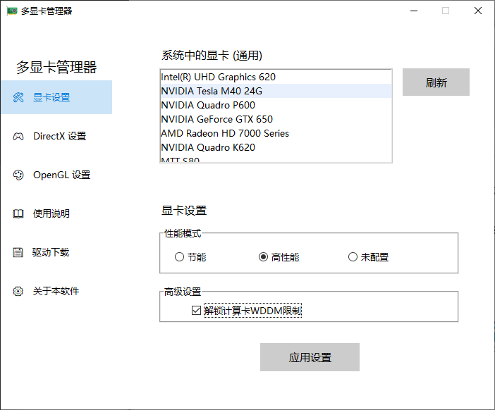
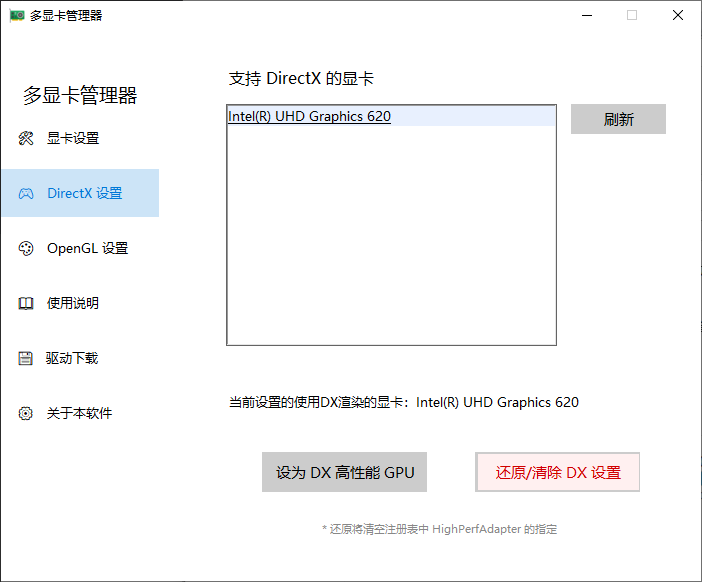
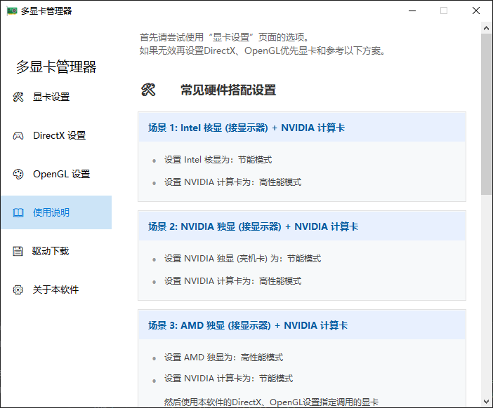

# TeslaCMP-MultiGraphicsManager

解锁Tesla显卡的WDDM输出模式，更改多显卡调用。

（例如将GeForce GTX750与Tesla M40 安装在同一台电脑上，显示器连接到GTX750上，使用GeForce输出显示画面，使用Tesla渲染游戏画面）
（类似笔记本电脑使用核显输出画面，使用独立显卡渲染）

同样的，本工具也可以用于解决 开启了CPU核显的机器 安装Tesla显卡后 的显卡调用问题

## 软件介绍

该工具提供了直观的图形界面，方便用户进行高性能、节能显卡设置、DirectX首选显卡和OpenGL首选显卡配置等操作。

### 主要功能

- **显卡设置**：管理系统中的所有显卡，配置性能模式（节能/高性能）以更改优先调用的显卡
- **DirectX 设置**：指定全局DirectX高性能GPU
- **OpenGL 设置**：管理和配置OpenGL ICD驱动，指定全局OpenGL高性能GPU
- **使用说明**：详细的软件使用指南
- **驱动下载**：快速访问显卡驱动下载页面
- **关于本软件**：软件版本信息和开发者信息

## 使用说明

1. 下载并运行可执行文件（需要管理员权限）
2. 在左侧导航栏选择需要的功能模块
3. 按照界面提示进行相应的设置和操作

### 注意事项

- 软件需要管理员权限才能修改系统设置
- 修改显卡设置前，请确保已备份重要数据
- 修改以后需要重启系统才能生效

## 下载

已编译好的可执行文件可在GitHub Release页面下载：

[下载地址](https://github.com/Skyler1n/TeslaCMP-MultiGraphicsManager/releases)

## 软件截图




## 系统要求

- Windows 10/11 64位操作系统
- Python 3.12或更高版本（仅用于编译）
- 支持的显卡，包括Tesla、CMP系列

## 编译说明

### 使用Python脚本编译

1. 确保已安装Python 3.12或更高版本
2. 克隆仓库到本地：
   ```bash
   git clone https://github.com/Skyler1n/TeslaCMP-MultiGraphicsManager.git
   cd TeslaCMP-MultiGraphicsManager
   ```
3. 运行编译脚本：
   ```bash
   python build_with_nuitka.py
   ```
4. 编译完成后，可执行文件将位于`output`目录中

### 编译依赖

编译过程中会自动安装以下依赖：
- Nuitka：用于将Python代码编译为可执行文件
- ordered-set：Nuitka的依赖项
- zstandard：Nuitka的依赖项
- tk-inter：用于GUI界面（Python标准库）

## 贡献

欢迎提交Issue和Pull Request来帮助改进这个项目！

## 许可证

本项目采用MIT许可证，详见LICENSE文件。

## 联系方式

如有问题或建议，请通过GitHub Issues与我们联系。
